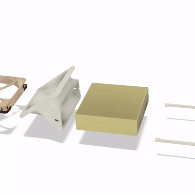
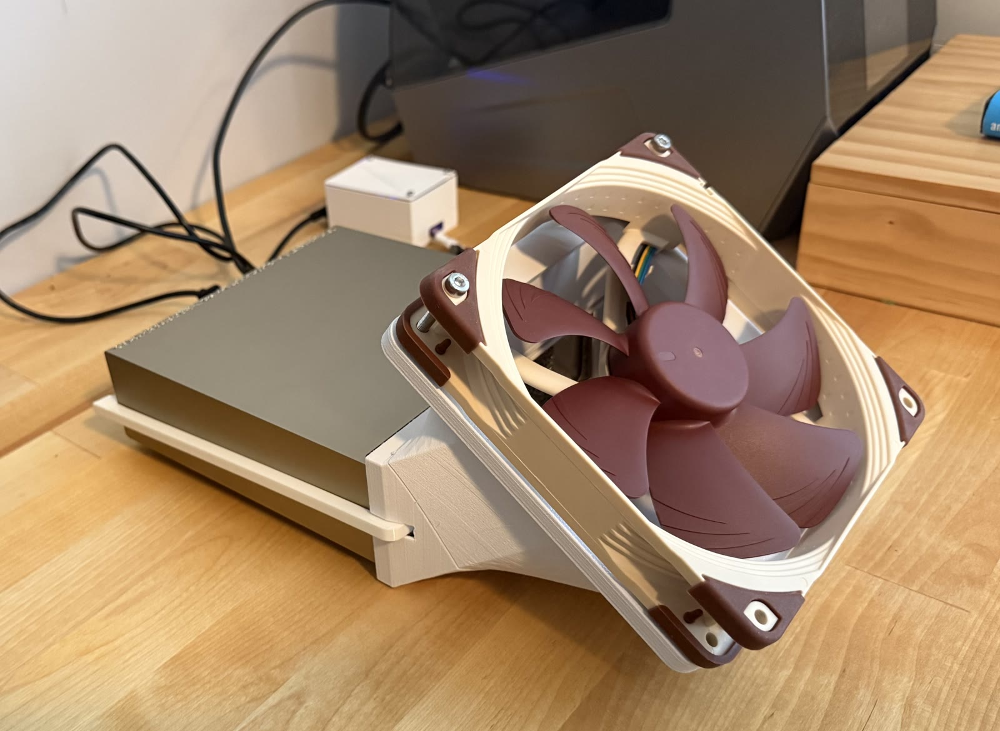
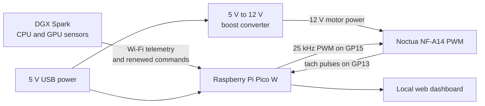
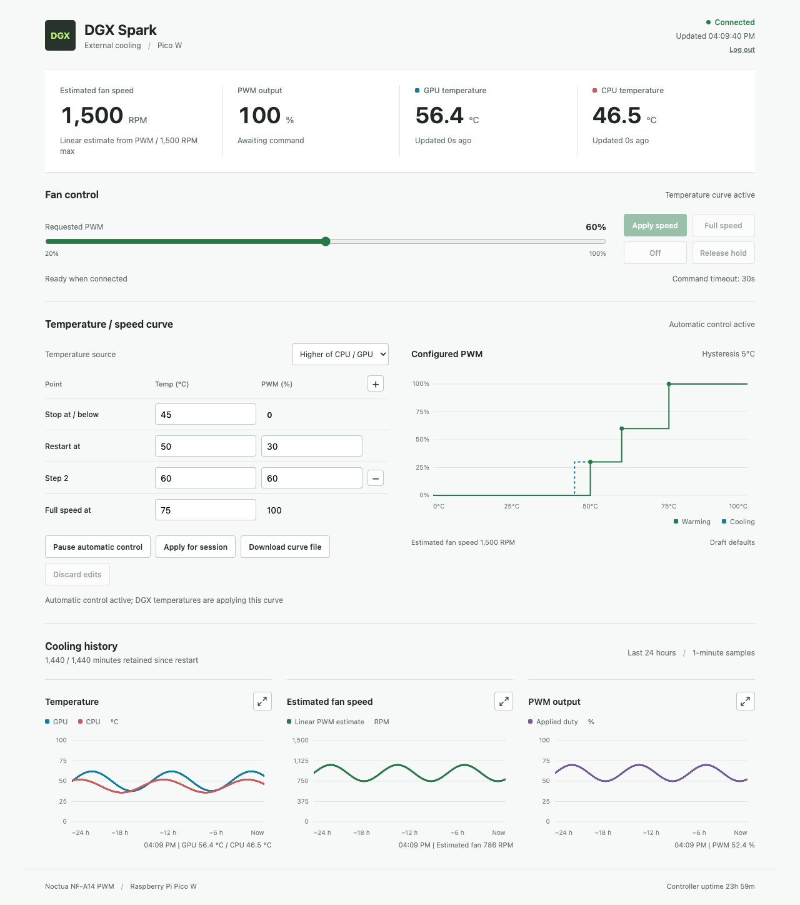

# Face Hugger Fan for NVIDIA DGX Spark

An open hardware and software project for adding a temperature-controlled
140 mm fan to an NVIDIA DGX Spark. A Raspberry Pi Pico W drives a standard
12 V Noctua NF-A14 PWM fan, tracks CPU/GPU temperature in a local dashboard, and accepts temperature
telemetry from a small Linux service running on the DGX Spark. 

The RPi Pico W controls the fan automatically following a temperature curve set in the dashboard. It only comes on when it is needed and the fan is powered by a USB port in the DGX directly. No opening the DGX. No excessive noise. It comes on as needed. Set and forget. 

The name of this repo comes from the printed fan mount and arms, which wrap around the DGX
Spark a little like a face hugger. It makes the DGX Spark not as pretty, but also about 4-5C cooler.

> [!CAUTION]
> This is an experimental, independently developed accessory. It is not endorsed
> by NVIDIA, Raspberry Pi, or Noctua, and it does not replace the DGX Spark's
> internal thermal management. Disconnect power before wiring. The fan motor is
> the only part of this design that receives 12 V. Use this at your own risk.

## Real build and printable parts

The photograph above shows the real assembled prototype. Both printable model
files are included in this repository:

- [Download the fan body / cover STL](hardware/stl/face-hugger-fan-dgx-spark-body.stl)
- [Download the two-arm set STL](hardware/stl/face-hugger-fan-dgx-spark-arms.stl)

See the [STL notes](hardware/stl/README.md) for dimensions, triangle counts,
checksums, scale guidance, and the current printing and assembly caveats.

## What is here

- Raspberry Pi Pico W CircuitPython firmware
- DGX Spark temperature collection and fan-control service
- Password-protected local web dashboard and temperature curve editor
- Illustrated wiring guide for the Pico W, boost converter, and 4-wire fan
- Bill of materials and fan specifications
- A quick-start installation guide
- Thermal comparison results with and without the external fan
- Printable body and mounting-arm STL files
- Desktop tests and continuous integration

## How it works

The Pico starts at full fan speed and returns to full speed if commands expire.
The DGX service reads CPU/GPU temperatures, evaluates the configured stepped fan
curve, and renews the selected PWM command every five seconds by default.

## Dashboard

The Pico hosts a responsive local dashboard for live CPU/GPU temperature,
estimated fan speed, PWM output, fan-curve editing, and 24-hour history. The view
below uses synthetic readings from the repository's test fixture; it contains no
live credentials or private network information.

## Measured result

In the 13 September 2026 comparison, the external fan's clearest benefit was
lower peak temperature and less variation - not lower averages:

| Metric | GPU, no fan | GPU, with fan | Change | CPU, no fan | CPU, with fan | Change |
| --- | ---: | ---: | ---: | ---: | ---: | ---: |
| Maximum | 78.0 °C | 68.0 °C | **-10.0 °C** | 91.6 °C | 76.7 °C | **-14.9 °C** |
| Standard deviation | 11.2 °C | 7.3 °C | **-3.9 °C** | 14.8 °C | 9.3 °C | **-5.5 °C** |
| Average | 60.8 °C | 62.1 °C | +1.3 °C | 68.0 °C | 69.8 °C | +1.8 °C |

See [Thermal test results](docs/thermal-results.md) for all published statistics,
the original report, and the limitations of this comparison.

## Start here

1. Read the [bill of materials](docs/bom.md) and obtain the parts.
2. Read the complete [illustrated wiring guide](docs/wiring.html) before connecting power.
3. Follow the [quick-start guide](docs/quick-start.md) to install the Pico firmware
   and the DGX service.
4. Review the [fan specifications](docs/fan-specifications.md) before substituting
   a different fan.
5. Read the [detailed software reference](docs/software-reference.md) for API,
   dashboard, fan-curve, failure-mode, and test documentation.

The printable body and two-arm set are available in [hardware/stl/](hardware/stl/).
STL files do not encode units, so read the model notes and verify dimensions in
your slicer before printing.

## Repository map

| Path | Contents |
| --- | --- |
| `code.py`, `fan_*.py`, `wifi_control.py` | Pico W firmware |
| `fan_curve.json` | Editable default temperature curve |
| `www/` | Pico-hosted dashboard |
| `lib/` | CircuitPython HTTP server dependency and its license |
| `dgx/` | DGX Spark telemetry script, environment template, and systemd service |
| `docs/` | BOM, wiring, installation, specifications, and test results |
| `hardware/stl/` | Printable body and two-arm STL models, with model metadata |
| `tests/` | Desktop unit and integration tests |

## Project status

This is a working experimental build, released so others can reproduce, inspect,
and improve it. The software includes fail-safe behavior, but no software can
guarantee cooling during loss of power, a microcontroller reset, wiring failure,
or a frozen processor. Validate your own assembly before unattended use.

## Contributing and license

Bug reports, test results, documentation improvements, and hardware adaptations
are welcome; see [CONTRIBUTING.md](CONTRIBUTING.md). The original project code and
documentation are licensed under the [MIT License](LICENSE). Bundled third-party
components retain their own licenses; see [THIRD_PARTY_NOTICES.md](THIRD_PARTY_NOTICES.md).

NVIDIA, DGX, Raspberry Pi, Noctua, and other names are trademarks of their
respective owners. Their use here identifies compatibility only.
